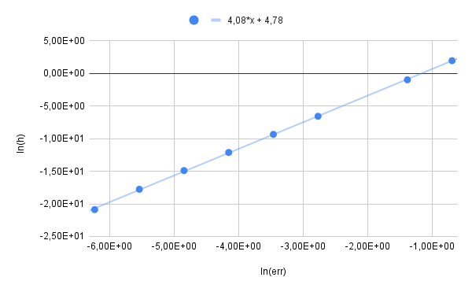

# Численное дифференцирование
Реализация метода неопределенных коэффициентов для приближенного поиска первой производной с наибольшим возможным порядком.

### Что поступает на вход:
Набор узлов в виде долей шага h от точки, в которой нужно найти производную

### Что выдает программа:
Набор коэффициентов для значений функции в указанных узлах, умноженные на h

Зависимость ошибки вычисления производной от шага. Наклон прямой демонстрирует порядок аппроксимации.

