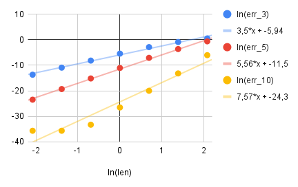

# Интерполяция Ньютона
Интерполяция функции $cos(x)$ по 3, 5, 10 точкам, равеномерно расположенным по отрезку интерполяции.

Графики зависимости ошибки интерполяции от длины отрезка интерполяции (логарифмический масштаб).

Рассматриваемые отрезки интерполяции: ` [0;8], [0;4], [0;2], [0;1], [0;0.5], [0;0.25], [0;0.125]  `

Ошибку интерполяции для каждого отрезка будем оценивать следующим образом: максимальный модуль разности между значением интерполянта и значением функции $cos(x)$ в 1000 точках, равномерно распределенных по отрезку интерполяции.

Для количества точек 5 и того же набора отрезков также проведем интерполяцию с использованием узлов Чебышева и сравним с ранее полученным результатом для того же количества точек:

.png)