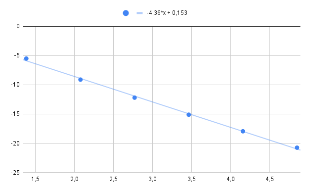

# Кубический сплайн

Интерполяция функции $cos(x)$ на отрезке [0, 3] с использованием 2, 4, 8, 16, 32, 64, 128 точек.

Построим зависимость ошибки интерполяции от количества точек. Ошибку интерполяции будем оценивать следующим образом: для 1000 точек, равномерно распределенных по отрезку, осуществлять выбор максимума отклонения функции от интерполянта в этих точках.

Наклон прямой говорит о порядке аппроксимации
