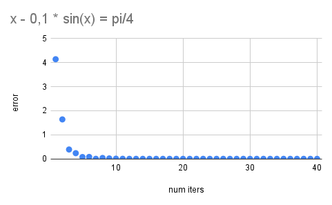
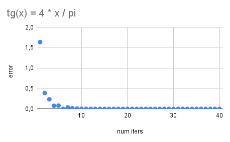
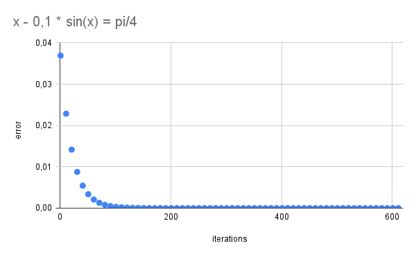
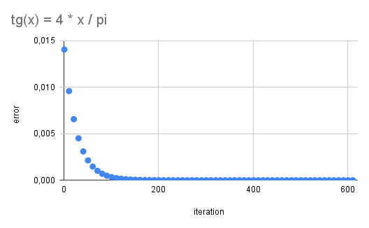
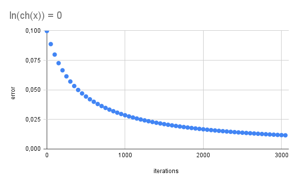
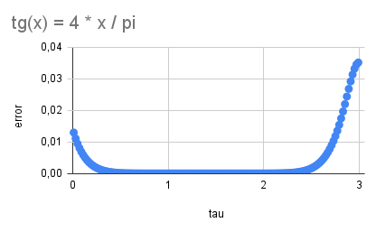
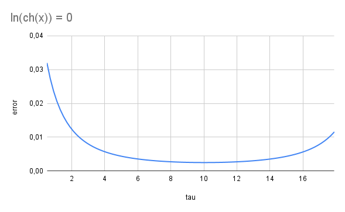
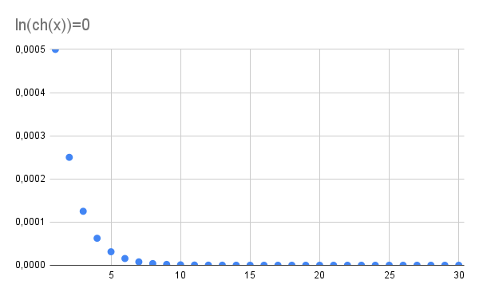
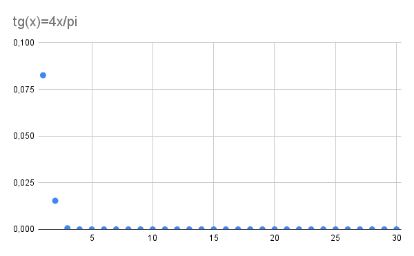

# Решение нелинейных уравнений
Реализация функции для решения нелинейных уравнений при помощи следующих методов:

- Метод половинного деления
- Метод простой итерации c релаксацией
- Метод Ньютона

При помощи реализованных функций производится решение:
- Уравнения Кеплера $x - e~sin(x) = M,~ e = 0.1, ~ M = \frac{\pi}{4}$
- Уравнения $tg(x) = \dfrac{4 x}{\pi}$ с начальным приближением в окрестости 1
- Уравнения $ln(ch~x) = 0$

Для каждого уравнения и для каждого метода решения построим зависимость ошибки от числа итераций. При использовании метода простой итерации с релаксацией также построим зависимость ошибки от параметра при фиксированом количестве итераций.

- Дихотомия

- МПИ

Зависимость ошибки от числа итераций

Зависимость ошибки от параметра при фиксированном числе итераций

- Ньютон

