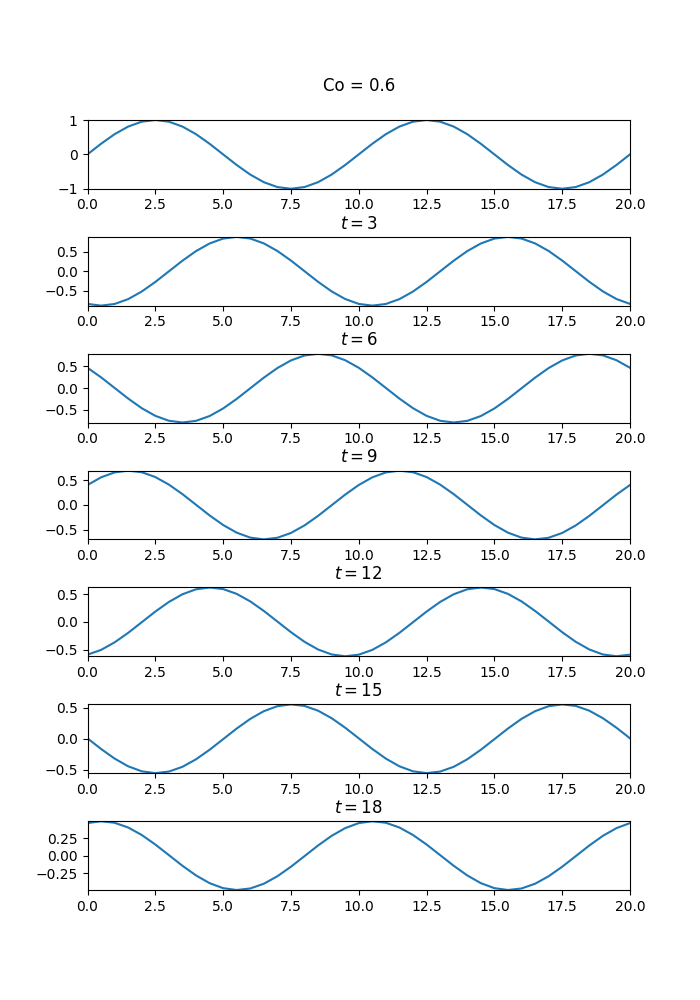
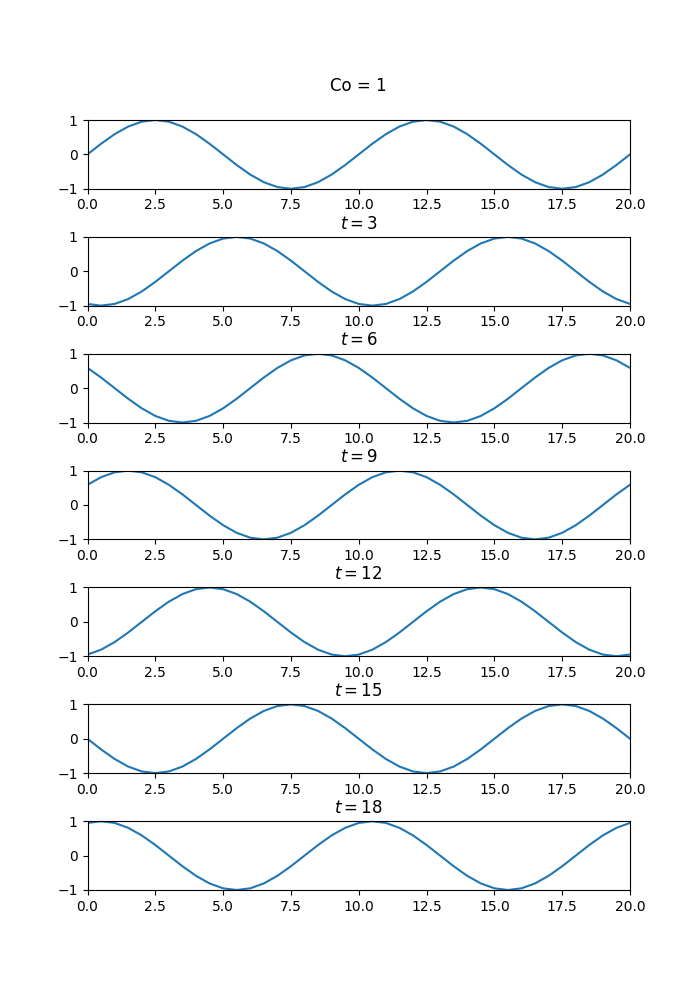
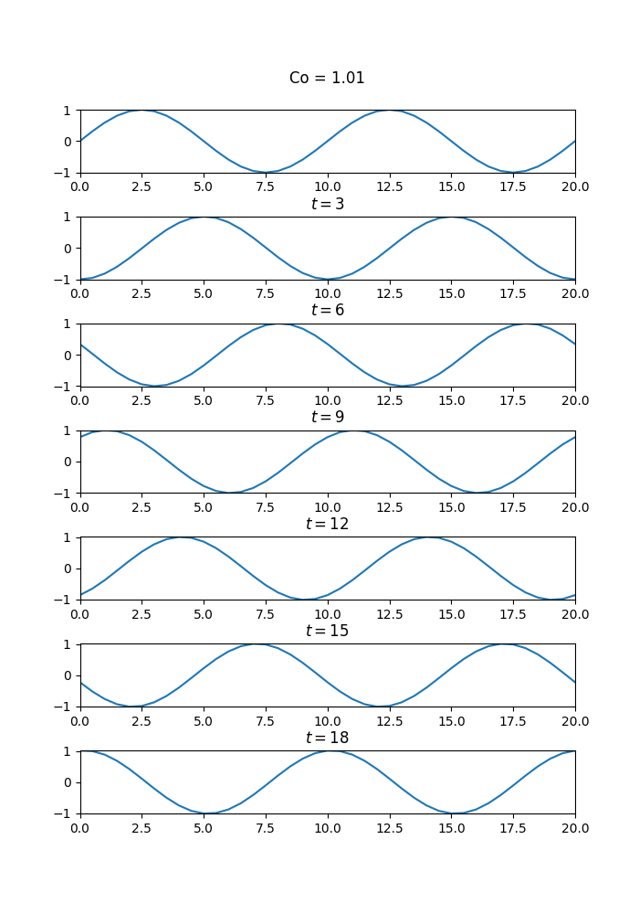
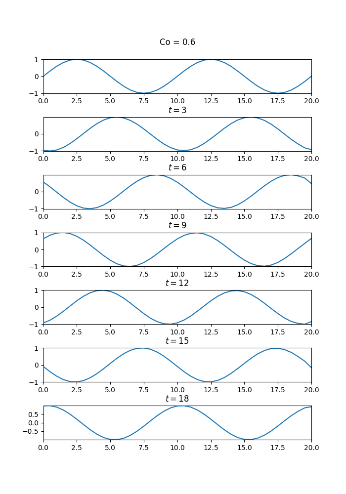
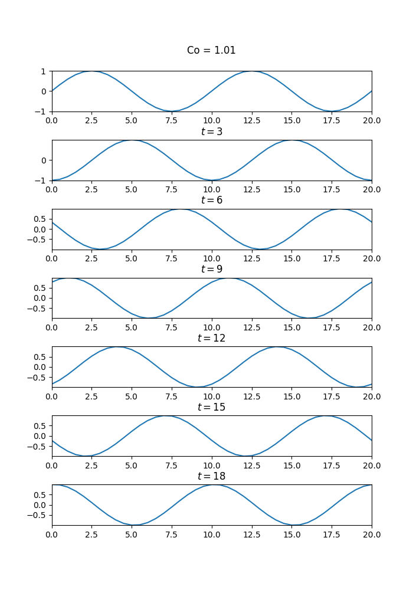
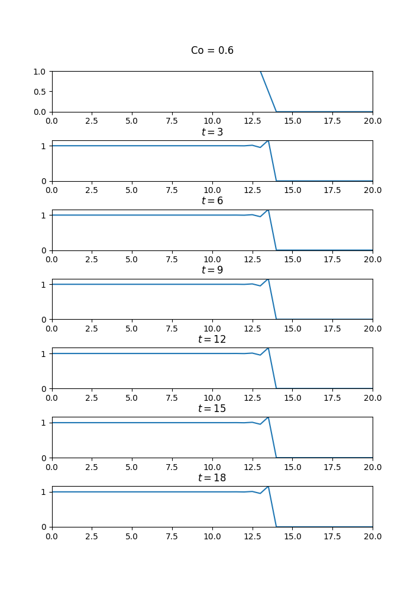
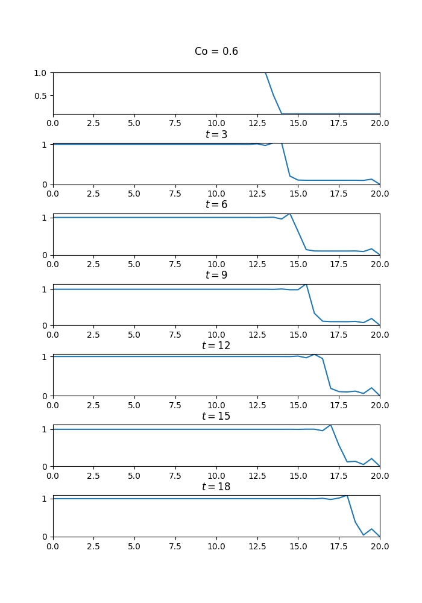

# Уравнение переноса
В качестве результата приводится распределние решения по пространственной координате $y(x_i)$ в различные моменты времени
# Используемый численный метод

Рассматриваются следующие схемы при различных числах Куранта:
- Cхема с разностями против потока:
    $\dfrac{y_{m}^{n+1} - y_{m}^{n}}{\tau} + \dfrac{y_{m}^{n} - y_{m-1}^{n}}{h} = 0$
- Схема Лакса-Вендроффа:

    $\dfrac{y_{m}^{n+1} - y_{m}^{n}}{\tau} + a\dfrac{y_{m+1}^{n} - y_{m-1}^{n}}{2h} - \dfrac{a^2\tau}{2}\dfrac{y_{m+1}^{n} - 2y_{m}^{n} + y_{m-1}^{n}}{h^2} = 0$

Исходная задача:
[Практические занятия по вычислительной математике
 в МФТИ : учеб. пособие / Е. Н. Аристова, А. И. Лобанов.
 Часть II. – М. : МФТИ, 2015. – 310 с., с. 219](https://mipt.ru/upload/medialibrary/39d/aristova_en_prakticheskie_zanyatiya_po_vychislitelnoi_matematike_v_mfti_chast_ii.pdf)

# Результаты

Размер области: $L = 20$, время расчета: $T = 18$.
Шаг по пространству: $h = 0.5$
Шаг по времени определяется из числа Куранта: $\tau = Co \cdot h$.

1. Начальное условие $u(x,0) = sin\left( \dfrac{4\pi x}{L}\right)$

Граничные условия периодические: при $x_1 = 0, x_{Nx} = L, i = 1, ..., Nx$
- для схемы "уголок"

$y^n_{0} = y^n_{i-1}$ 

$y^{n+1}_{1} = y^{n+1}_{Nx}$
- для схемы Лакса-Вендроффа

$y^{n+1}_{Nx} = f(y^{n}_{Nx-1}, y^{n}_{Nx}, y^{n}_{1})$

$y^{n+1}_{1} = f(y^{n}_{Nx}, y^{n}_{1}, y^{n}_{2})$

### Уголок

### Лакс-Вендрофф

2. Исследование уравнения Хопфа: $u_t + u \cdot u_x = 0$

Устанавливая граничные условия типа Дирихле и начальный профиль вида "ступеньки", например, следующим образом:
$$
y(x)=
\begin{cases}
1 & \quad \text{$x < 13$}\\ 
-x + 14 & \quad \text{$x \geq 13$ and $x < 14$} \\
0 & \quad \text{othewise}
\end{cases}
$$
$y^{n+1}_{Nx} = 0$

$y^{n+1}_{1} = 1$

можно наблюдать последствия неопределенности решения - так называемая "градиентная катастрофа"

При незначительном измении начальных условий, например:
$$
y(x)=
\begin{cases}
1 & \quad \text{$x < 13$}\\ 
-x + 14 & \quad \text{$x \geq 13$ and $x < 13.9$} \\
0.1 & \quad \text{othewise}
\end{cases}
$$

решение приобретает вид:

