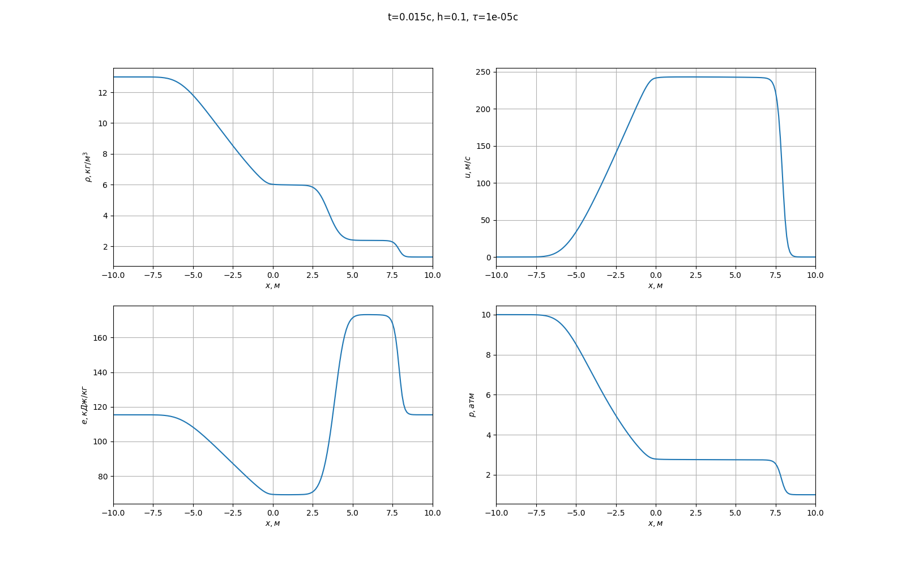
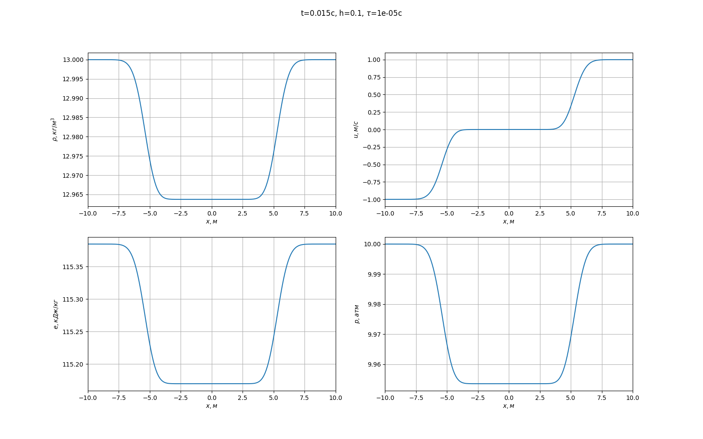

# Задача Римана о распаде разрыва
Рассматривается одномерная область $x \in [-L, L]$, $L = 10 см$, заполненная идеальным газом (показатель адиабаты 5/3). Посередине области (при $x = 0$) располагается перегородка, по обе стороны от которой газ имеет различные термодинамические параметры.
В частности:
- слева: $v_l = 0, \rho_l = 13 \dfrac{kg}{m^3} , P_l = 10 атм$
- справа: $v_r = 0, \rho_r = 1.3 \dfrac{kg}{m^3} , P_r = 1 атм$

# Используемый численный метод

Cхема Куранта-Изоксона-Риса:

[Упражнения и задачи контрольных работ
 по вычислительной математике. Ч. II. : учеб. пособие /
 А. В. Барабанщиков, Т. М. Гамилов, В. В. Демченко и др.; c. 106 - 108](http://books.mipt.ru/book/296965/uprazhnenija-i-zadachi-kontrolnyh-rabot-po-vychislitelnoj-matematike-uchebnoe-posobie-chast-2.pdf?h=)

# Результаты

Подсчет ведется до 0.02 с.
Распределние переменных в момент времени 0.015 с при вышеупомянутых заданных начальных параметрах:

    v_l = 0
    rho_l = 13
    p_l = 10e5

    v_r = 0
    rho_r = 1.3
    p_r = 10e5

Можно получить и другие волновые конфигурации: например, две волны разрежения, приравнимая начальные плотности и даления при одинаковых по велечине и противоположных по направлению скоростях
см. подробнее: [Задача о распаде произвольного разрыва, А.Т.Ильичев и А.Г.Куликовский](http://mathcenter.spb.ru/nikaan/book/kochin_math.pdf)

    v_l = -1
    rho_l = 13
    p_l = 10e5

    v_r = 1
    rho_r = 13
    p_r = 10e5
